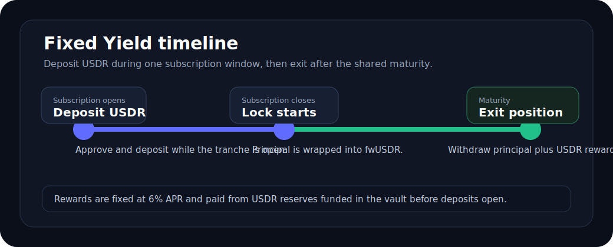

# Fixed Yield

Fixed Yield is a USDR deposit product. Users deposit `USDR` during a subscription window, wait until the shared maturity,
and then exit to receive principal plus a fixed USDR reward.



## What users can do

- Deposit `USDR` while the tranche is open.
- Make multiple deposits during the same subscription window; the position accumulates.
- Exit after maturity to withdraw all principal and claim the fixed reward.

The current frontend flow is USDR-only. Users who start with `USDT`, `USDC`, or `DAI` can first use
[USDR Mint](./usdr-mint) or available swap liquidity to get USDR.

## Phase timeline

Each tranche has three important timestamps:

| Phase | What happens |
| --- | --- |
| Subscription opens | Users can start depositing USDR. |
| Subscription closes | New deposits stop. The lock period is measured from this point. |
| Maturity | Users can exit and receive principal plus reward. |

The interface shows the current phase, remaining cap, total deposited amount, and maturity.

## Reward model

Rewards are fixed at `6% APR` for the configured term.

The reward is calculated over the tranche term:

```text
reward = principal * 6% * (maturity - subscription close) / 365 days
```

This means all deposits in the same tranche share one maturity and one fixed term. A user who deposits more than once
during the subscription window accumulates one position, rather than creating separate per-deposit maturities.

Rewards are paid in `USDR`.

## Deposit flow

1. The user gets USDR through [USDR Mint](./usdr-mint) or swap liquidity.
2. The user approves the Fixed Yield vault to spend USDR.
3. During the subscription window, the user deposits USDR.
4. The vault wraps the deposited principal into `fwUSDR`.
5. The user's principal and fixed reward are recorded.
6. After maturity, the user exits the position.
7. The vault unwraps principal back to USDR and transfers the recorded USDR reward.

## Reward funding

The vault must already hold enough USDR reward reserve to cover new deposits. If reward reserves are not funded, deposits
are blocked rather than accepting underfunded positions.

This is why the interface may show a disabled or failed deposit state even if the user has enough USDR. The vault checks
that rewards for existing positions plus the new deposit can be paid.

## Why a deposit can fail

| Reason | What it means |
| --- | --- |
| Not open yet | The current time is before the subscription start. |
| Subscription closed | The current time is after the subscription end. |
| Cap reached | The tranche has reached its USDR deposit cap. |
| Reward reserve not funded | The vault does not have enough USDR reward reserve for the new liability. |
| Deposit paused | The guardian has paused new deposits. Existing withdrawals are not paused. |
| Approval rejected | The wallet approval transaction was rejected or timed out. |
| Before maturity exit | Principal and rewards can only be exited after maturity. |

## Security model

The Fixed Yield vault is designed as a narrow fixed-term vault:

- no owner
- no upgradeability
- no lending
- no AMO
- no LP operations
- no admin sweep
- no withdrawal pause

The immutable guardian can pause or unpause new deposits, and can reschedule an empty tranche before any deposit enters.
The guardian cannot withdraw principal, redirect withdrawals, change APR, change caps, add tokens, or pause exits.

Once any USDR has been deposited, the schedule for that tranche is locked.

## Relationship to USDR Mint

USDR Mint and Fixed Yield are separate flows:

- `USDR Mint`: deposit `USDT`, `USDC`, or `DAI` and receive `USDR`.
- `Fixed Yield`: deposit `USDR` and receive principal plus fixed USDR reward after maturity.

This keeps minting, liquidity exits, and fixed-yield deposits separate so each contract has a smaller responsibility.
