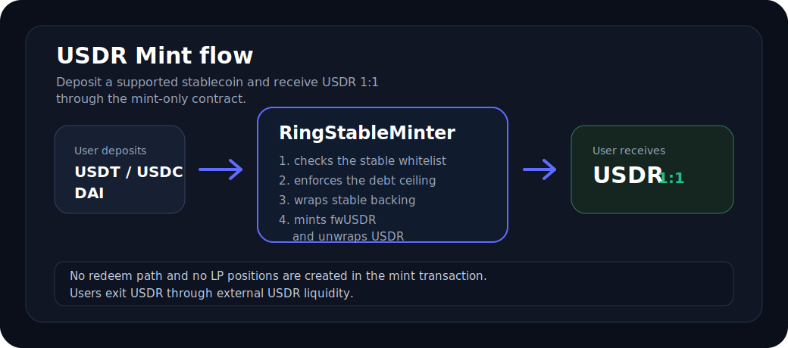

# USDR Mint

USDR Mint lets users deposit a supported stablecoin and receive `USDR` at a 1:1 rate through Ring Interface.

## What users can do

- Deposit `USDT`, `USDC`, or `DAI`.
- Receive `USDR` 1:1, using the stablecoin's own decimals on input and USDR decimals on output.
- Use the minted `USDR` in Ring products such as Fixed Yield, or exit through available USDR swap liquidity.

USDR Mint is not an AMM swap. The mint contract does not quote from a pool and does not create LP positions during a
user mint.

## How minting works

1. The user connects a wallet and selects a supported input token.
2. The user approves the `RingStableMinter` contract to spend the input stablecoin.
3. The user submits `mint(stable, amountIn, minAmountOut, recipient)`.
4. The minter pulls exactly `amountIn` from the wallet.
5. The stablecoin is wrapped into its matching FewToken, such as `fwUSDT`, `fwUSDC`, or `fwDAI`.
6. The minter mints `fwUSDR` and unwraps it into origin `USDR` for the recipient.
7. The user receives `USDR`; the stable-backed FewToken remains locked as backing inside the mint flow.

## Supported assets

| User deposits | User receives | Rate |
| --- | --- | --- |
| `USDT` | `USDR` | 1:1 |
| `USDC` | `USDR` | 1:1 |
| `DAI` | `USDR` | 1:1 |

The interface only shows the supported stablecoins for the configured network.

## Why a mint can fail

| Reason | What it means |
| --- | --- |
| Wrong network | The wallet must be connected to the network where the minter is configured. |
| Insufficient balance | The wallet does not have enough input stablecoin for the entered amount. |
| Approval rejected | The wallet approval transaction was rejected or timed out. |
| Debt ceiling reached | Each stablecoin has an immutable mint cap. If the cap is reached, a larger mint will revert. |
| USDR reserve too low | `fwUSDR` must hold enough origin USDR so the unwrap can send USDR to the user. |
| Amount precision loss | Very small amounts can be rejected if they cannot be represented exactly after decimal conversion. |
| Unsupported token | Only the configured `USDT`, `USDC`, and `DAI` addresses are supported. |

If a large mint fails while smaller mints work, the most likely cause is the per-stable debt ceiling rather than wallet
balance.

## Security model

The mint contract is intentionally small:

- no owner
- no post-deploy setters
- no pause function
- no redeem function
- no AMO
- no LP minting
- no admin withdrawal path

Supported stables, FewToken addresses, and per-stable debt ceilings are fixed at deployment. If a limit needs to change,
a new minter must be deployed and the interface must point to the new address.

## Exiting USDR

The mint contract does not redeem USDR back to stablecoins. Users who want to exit USDR should use available USDR swap
liquidity, such as the liquidity surfaced through Ring Interface.

This separation keeps the mint path smaller and avoids adding redeem, AMO, reserve-release, or LP-management policy to
the mint contract.
